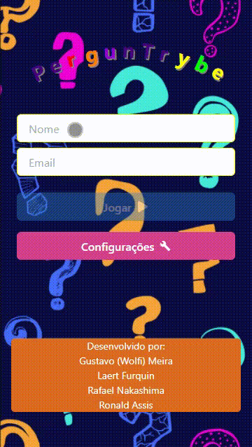

# Boas vindas ao repositório do projeto de Trivia!

Esse é um projeto que realizei em grupo com alguns colegas de turma na Trybe!

### Habilidades

Nesse projeto contém:

  - store Redux em aplicações React

  - Reducers no Redux em aplicações React

  - Actions no Redux em aplicações React

  - Dispatchers no Redux em aplicações React

  - Conectar Redux aos componentes React

  - Actions assíncronas na sua aplicação React que faz uso de Redux.
  
  - Trello para decidir quem ficará com qual componente

---

## GAME TRIVIA

